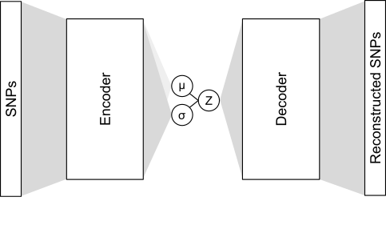
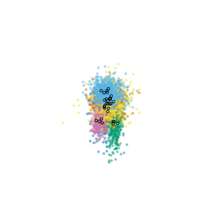

# sp_deli

A variational autoencoder (VAE) is used to learn a reduced representation of the SNP dataset by minimizing the difference between the input SNPs and the reconstructed SNPs.

The mean (&mu;) and standard deviation (&sigma;) are used for plotting. The black circles indicate the &mu;. The transparent colors show the &sigma; (100 sampled "Z" or latent variables for each organism). For the following animation, we show the change of &mu; and &sigma; during optimization (1 frame per 10 epoches). Each color represents a different species.

For more info, see pre-print here:
https://www.biorxiv.org/content/early/2018/09/28/429662
